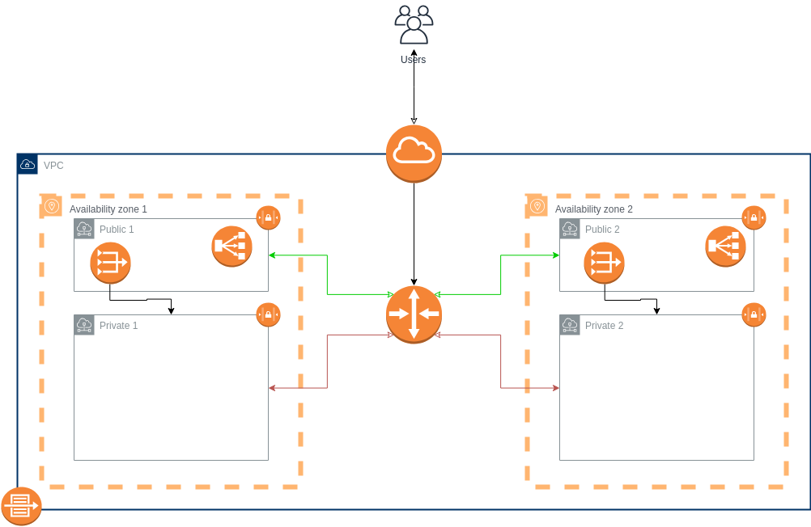

# AWS VPC Terraform module

Terraform module irá criar recursos VPC em AWS.



O codigo irá prover os seguintes recursos na AWS.
* [VPC](https://www.terraform.io/docs/providers/aws/r/vpc.html)
* [VPC Flow Log](https://www.terraform.io/docs/providers/aws/r/flow_log.html)
* [CloudWatch Log](https://www.terraform.io/docs/providers/aws/r/cloudwatch_log_group.html)
* [Subnet](https://www.terraform.io/docs/providers/aws/r/subnet.html)
* [Route](https://www.terraform.io/docs/providers/aws/r/route.html)
* [Route table](https://www.terraform.io/docs/providers/aws/r/route_table.html)
* [Internet Gateway](https://www.terraform.io/docs/providers/aws/r/internet_gateway.html)
* [Network ACL](https://www.terraform.io/docs/providers/aws/r/network_acl.html)
* [NAT Gateway](https://www.terraform.io/docs/providers/aws/r/nat_gateway.html)
* [DHCP Options Set](https://www.terraform.io/docs/providers/aws/r/vpc_dhcp_options.html)
* [Default VPC](https://www.terraform.io/docs/providers/aws/r/default_vpc.html)
* [Default Network ACL](https://www.terraform.io/docs/providers/aws/r/default_network_acl.html)
* [Elastic IP](https://www.terraform.io/docs/providers/aws/r/eip.html)


## Terraform Remote State
O block terraform no arquivo main.tf, diz para aonde o terraform deve armazenar o estado definido da sua infra. 
Isso ajuda trabalhar com o Terraform em equipe, assim cada devops deve ter o estado mais recente da infraestrutura.

O backend remoto utilizado aqui foi S3 Bucket.

Obs: O bucket deve está previamente criado.
```hcl
terraform {
    backend "s3" {
        profile = "terraform-user"
        bucket = "bucket-terraform-remote-state-lab"
        key    = "developer/terraform.tfstate"
        region = "sa-east-1"
        skip_requesting_account_id = true
        skip_credentials_validation = true
        skip_get_ec2_platforms = true
        skip_metadata_api_check = true
    }
}
```

## Usage

```hcl
module "create_vpc" {
    source = "../../../modules/networking/vpc/"

    vpc_name    = "TF-Lab"
    cidr_block  = "10.100.0.0/18"
    region      = "sa-east-1"
    avail_zones = [ "sa-east-1a", "sa-east-1c" ]

    assign_generated_ipv6_cidr_block = "false"

    enable_dns_hostnames    = "true"
    enable_dns_support      = "true"

    instance_tenancy        = "default"

    # VPC Flow Logs
    traffic_type        = "ALL"
    retention_in_days   = "3"

    # VPC DHCP Options Set
    domain_name_servers = "AmazonProvidedDNS"

    # VPC Default Network ACL, Default is true
    # create_network_acl    = "false"

    # VPC Default Secuity Group, Default is true
    # create_sg-default = "false"


    # VPC Subnets
    # Specify true to indicate that instances launched into
    # the subnet should be assigned a public IP address. Default is false.
    map_public_ip_on_launch         = "false"
    map_public_ip_on_launch_sn_pub  = "true"

    # Working with a DB Instance in a VPC, Default is true.
    # create-db-subnet-group  = "false"

    default_tags = {
        ApplicationRole = "VPC-Lab"
        Environment     = "Lab"
        Customer        = "jslopes"
        Owner           = "jslopes"
    }
}
```

## External NAT Gateway IPs
Por padrão, este módulo provisionará novos Elastic IPs para os NAT gateways da VPC. 
Isso significa que, ao criar uma nova VPC, novos IPs são alocados e, quando essa VPC é destruída, esses IPs são liberados.


